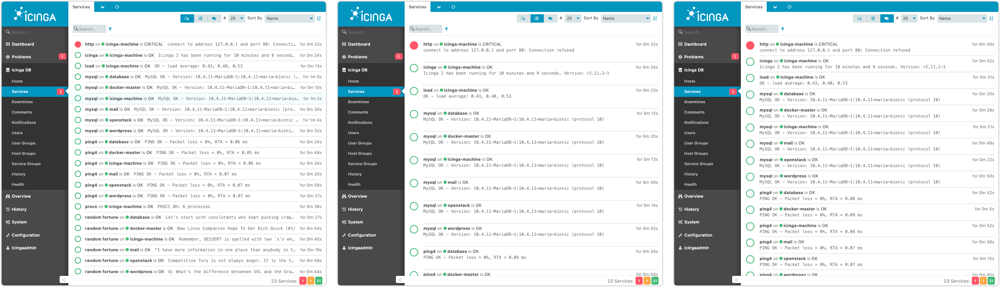
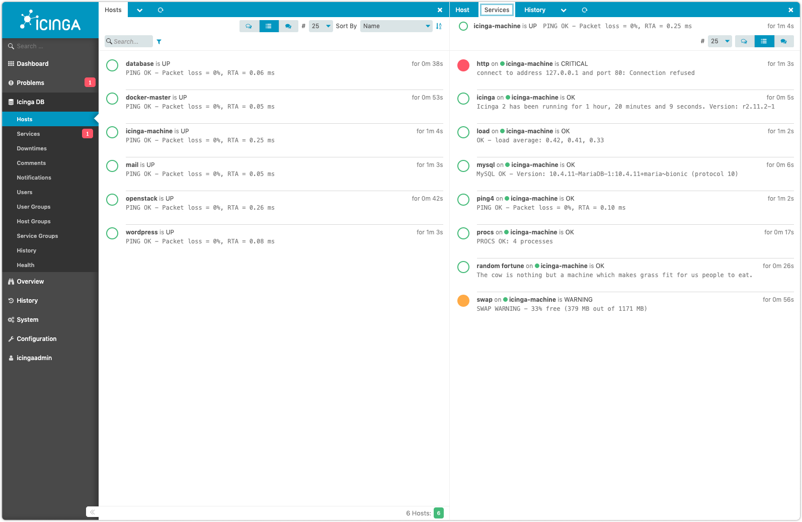
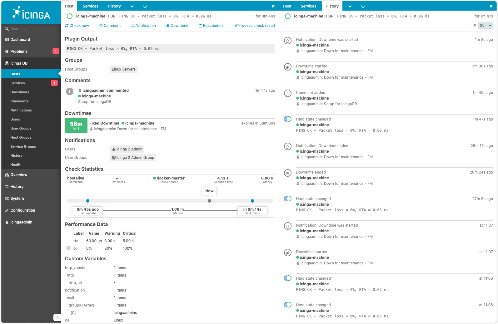

# Icinga DB Web

1. [About](#about)
2. [Documentation](README.md#documentation)
3. [Installation](README.md#installation)
4. [Configuration](README.md#configuration)

## About

**Icinga DB Web** pushes your monitoring stack to the next level.

Based on the lessons learnt with the base monitoring module, it offers a modern
and streamlined design to provide a clear and concise overview of your monitoring
environment.

It adds new features, such as:

TODO: Check if there aren't some more fancy features..

- Bulk operations to schedule downtimes for host groups and alike.
- Enhanced action workflows with In-window modals.
- View switching to chose how much detail will be displayed.
- Improved status bar with applied filters.

TODO: Update screenshots

## Documentation

The documentation is located in the [doc/](doc/) directory and also available
on [icinga.com/docs](https://icinga.com/docs/icingadb-web/latest/).

## Installation

For installing Icinga DB Web please check the [installation](https://icinga.com/docs/icingadb-web/latest/doc/02-Installation/)
chapter.

## Configuration

To configure Icinga DB Web please check the [configuration](https://icinga.com/docs/icingadb-web/latest/doc/03-Configuration/)
chapter.
