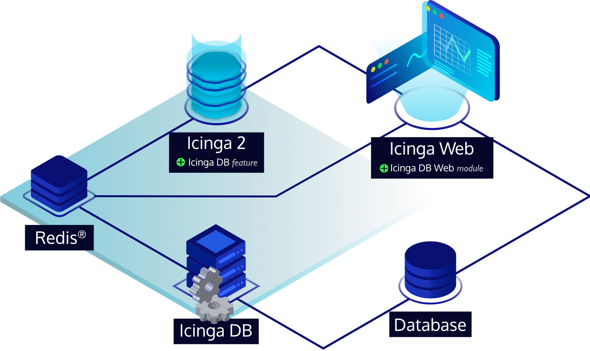
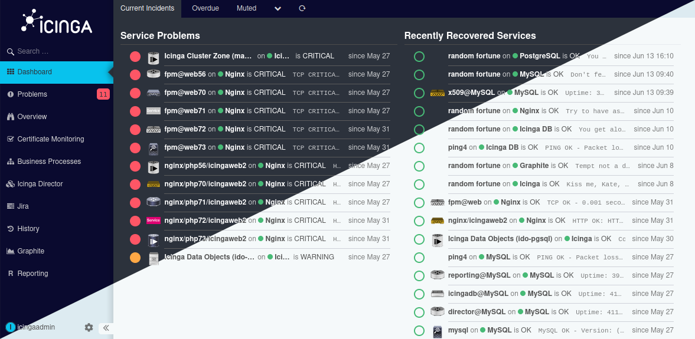
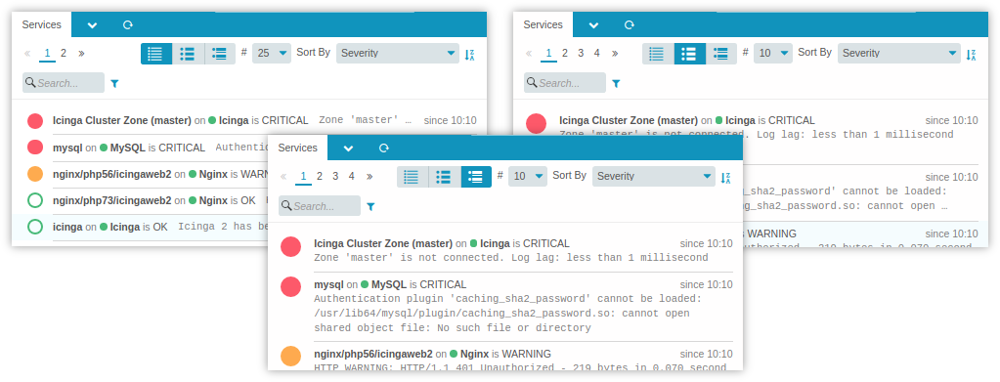
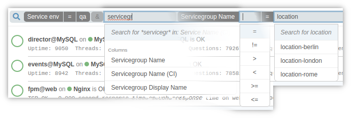
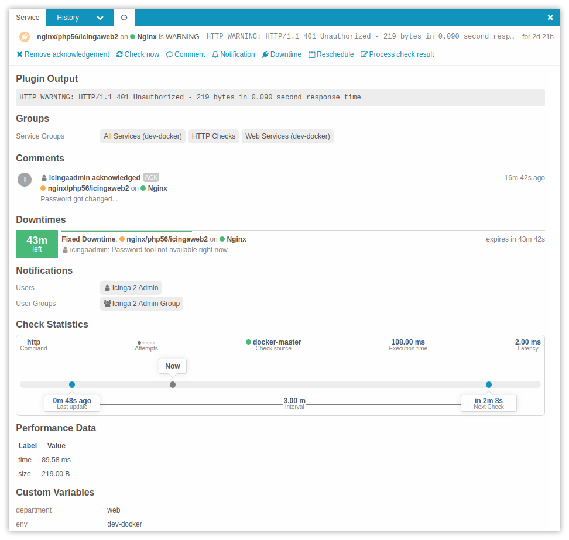
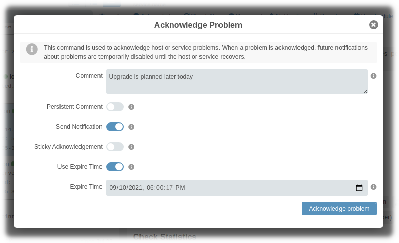
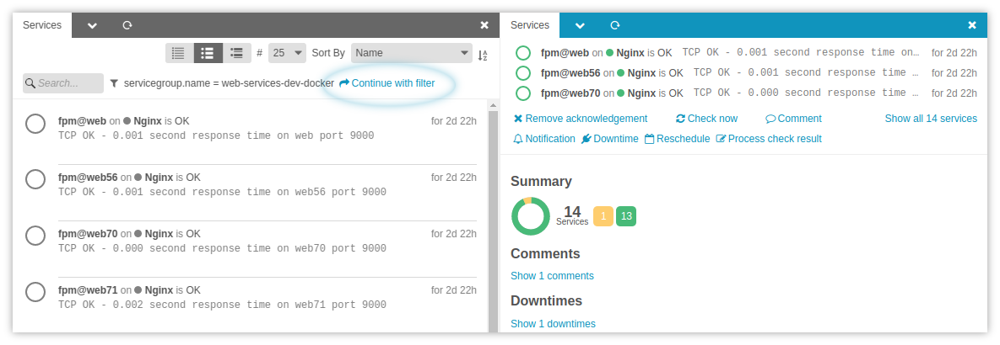

# Icinga DB Web

Icinga DB is a set of components for publishing, synchronizing and
visualizing monitoring data in the Icinga ecosystem, consisting of:

* Icinga DB Web which connects to both a Redis server and a database to view and work with monitoring data
* Icinga 2 with its [Icinga DB feature](https://icinga.com/docs/icinga-2/latest/14-features/#icinga-db) enabled,
  responsible for publishing monitoring configuration, check results,
  states changes and history items to the Redis server
* And the [Icinga DB daemon](https://icinga.com/docs/icinga-db/latest/01-About/),
  which synchronizes monitoring data between the Redis server and the database

## Features

Icinga DB Web offers a modern and streamlined design to provide a clear and
concise overview of your monitoring environment, also with dark and light mode support.

### Various List Layouts

The view switcher allows to control the level of detail displayed in host and service list views:

### Search with Autocomplete

The search bar in list views can be used for everything from simple searches to creating complex filters.
It allows full keyboard control and also supports contextual auto-completion.
In addition, there is an editor for easier filter creation.

### Clean Detail Views

Host and service detail views are structured to make best use of available space.
Related information is grouped and important information is at the top for instant access without having to scroll down.

### Modal Dialogs

Any interaction that requires user input, such as acknowledging problems, scheduling downtimes, etc.,
shows a modal dialog over the current view to preserve context and focus on interaction.

### Bulk Operations

Bulk interactions such as scheduling downtimes for multiple objects, acknowledging multiple problems, etc.
are easily accomplished with the `Continue With` control that operates on filtered lists.

## Installation

To install Icinga DB Web see [Installation](02-Installation.md).

## License

Icinga DB Web and the Icinga DB Web documentation are licensed under the terms of the
GNU General Public License Version 2.
