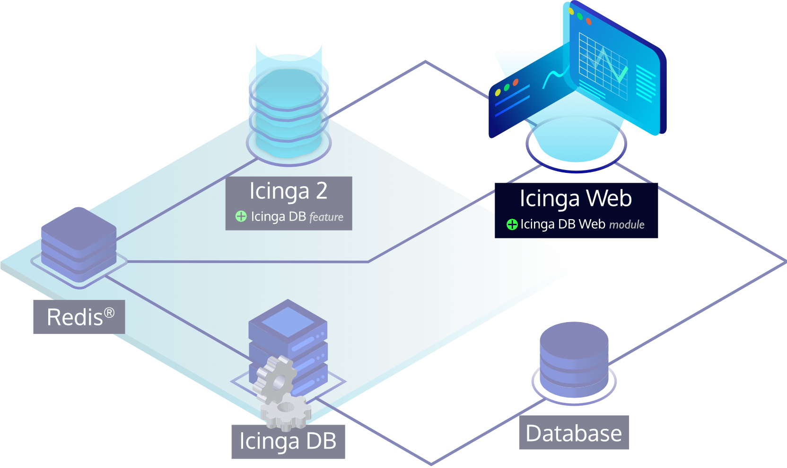

<!--  -->
# Installing Icinga DB Web

The recommended way to install Icinga DB Web is to use prebuilt packages for
all supported platforms from our official release repository.
Please follow the steps listed for your target operating system,
which guide you through setting up the repository and installing Icinga DB Web.

To upgrade an existing Icinga DB Web installation to a newer version,
see the [Upgrading](05-Upgrading.md) documentation for the necessary steps.



Before installing Icinga DB Web, make sure you have installed the
[Icinga DB daemon](https://icinga.com/docs/icinga-db/latest/doc/02-Installation/).

<!--  -->
<!--  -->
## Adding Icinga Package Repository

The recommended way to install Icinga DB Web is to use prebuilt packages from our official release repository.

!!! tip

    If you install Icinga DB Web on a node that has Icinga 2, Icinga DB or Icinga Web installed via packages,
    proceed to [installing the Icinga DB Web package](#installing-icinga-db-web-package) as
    the repository is already configured.

Here's how to add the official release repository:

<!--  -->
<!--  -->
### Amazon Linux 2 Repository
<!--  -->
!!! info

    A paid repository subscription is required for Amazon Linux 2 repositories. Get more information on
    [icinga.com/subscription](https://icinga.com/subscription).

    Don't forget to fill in the username and password section with appropriate credentials in the local .repo file.

```bash
rpm --import https://packages.icinga.com/icinga.key
wget https://packages.icinga.com/subscription/amazon/ICINGA-release.repo -O /etc/yum.repos.d/ICINGA-release.repo
```
<!--  -->

<!--  -->
<!--  -->
### CentOS Repository
<!--  -->
```bash
rpm --import https://packages.icinga.com/icinga.key
wget https://packages.icinga.com/centos/ICINGA-release.repo -O /etc/yum.repos.d/ICINGA-release.repo
```
<!--  -->

<!--  -->
<!--  -->
### Debian Repository
<!--  -->

```bash
apt update
apt -y install apt-transport-https wget gnupg

wget -O - https://packages.icinga.com/icinga.key | apt-key add -

DIST=$(awk -F"[)(]+" '/VERSION=/ {print $2}' /etc/os-release); \
 echo "deb https://packages.icinga.com/debian icinga-${DIST} main" > \
 /etc/apt/sources.list.d/${DIST}-icinga.list
 echo "deb-src https://packages.icinga.com/debian icinga-${DIST} main" >> \
 /etc/apt/sources.list.d/${DIST}-icinga.list

apt update
```
<!--  -->

<!--  -->
<!--  -->
### RHEL Repository
<!--  -->
!!! info

    A paid repository subscription is required for RHEL repositories. Get more information on
    [icinga.com/subscription](https://icinga.com/subscription).

    Don't forget to fill in the username and password section with appropriate credentials in the local .repo file.

```bash
rpm --import https://packages.icinga.com/icinga.key
wget https://packages.icinga.com/subscription/rhel/ICINGA-release.repo -O /etc/yum.repos.d/ICINGA-release.repo
```
<!--  -->

<!--  -->
<!--  -->
### SLES Repository
<!--  -->
!!! info

    A paid repository subscription is required for SLES repositories. Get more information on
    [icinga.com/subscription](https://icinga.com/subscription).

    Don't forget to fill in the username and password section with appropriate credentials in the local .repo file.

```bash
rpm --import https://packages.icinga.com/icinga.key

zypper ar https://packages.icinga.com/subscription/sles/ICINGA-release.repo
zypper ref
```
<!--  -->

<!--  -->
<!--  -->
### Ubuntu Repository
<!--  -->

```bash
apt update
apt -y install apt-transport-https wget gnupg

wget -O - https://packages.icinga.com/icinga.key | apt-key add -

. /etc/os-release; if [ ! -z ${UBUNTU_CODENAME+x} ]; then DIST="${UBUNTU_CODENAME}"; else DIST="$(lsb_release -c| awk '{print $2}')"; fi; \
 echo "deb https://packages.icinga.com/ubuntu icinga-${DIST} main" > \
 /etc/apt/sources.list.d/${DIST}-icinga.list
 echo "deb-src https://packages.icinga.com/ubuntu icinga-${DIST} main" >> \
 /etc/apt/sources.list.d/${DIST}-icinga.list

apt update
```
<!--  -->

## Installing Icinga DB Web Package

Use your distribution's package manager to install the `icingadb-web` package as follows:

<!--  -->
<!--  -->
#### Amazon Linux 2
<!--  -->
```bash
yum install icingadb-web
```
<!--  -->

<!--  -->
<!--  -->
#### CentOS
<!--  -->
!!! info

    Note that installing Icinga DB Web is only supported on CentOS 7 as CentOS 8 is EOL.

```bash
yum install icingadb-web
```
<!--  -->

<!--  -->
<!--  -->
#### Debian / Ubuntu
<!--  -->
```bash
apt install icingadb-web
```
<!--  -->

<!--  -->
#### RHEL 8 or Later

```bash
dnf install icingadb-web
```

#### RHEL 7

```bash
yum install icingadb-web
```
<!--  -->

<!--  -->
<!--  -->
#### SLES
<!--  -->
```bash
zypper install icingadb-web
```
<!--  -->

<!--  --><!-- {# end if not from_source #} -->
<!--  -->
## Installing Icinga DB Web from Source
<!--  -->

Please see the Icinga Web documentation on
[how to install modules](https://icinga.com/docs/icinga-web-2/latest/doc/08-Modules/#installation) from source.
Make sure you use `icingadb` as the module name. The following requirements must also be met.

### Requirements

* PHP (≥7.2)
* MySQL or PostgreSQL PDO PHP libraries
* The following PHP modules must be installed: `cURL`, `dom`, `json`, `libxml`
* [Icinga DB](https://github.com/Icinga/icingadb)
* [Icinga Web 2](https://github.com/Icinga/icingaweb2) (≥2.9)
* [Icinga PHP Library (ipl)](https://github.com/Icinga/icinga-php-library) (≥0.10)
* [Icinga PHP Thirdparty](https://github.com/Icinga/icinga-php-thirdparty) (≥0.11)
<!--  --><!-- {# end else if not from_source #} -->

## Configuring Icinga DB Web

<!--  -->
The Icinga Web PHP framework is required to configure and run the Icinga DB Web module.
Package installations of `icingadb-web` already set up the necessary dependencies.
If Icinga Web has not been installed or set up before,
you have completed the instructions here and can proceed to
<!--  -->
[install the web server on Amazon Linux](https://icinga.com/docs/icinga-web-2/latest/doc/02-Installation/06-Amazon-Linux/#install-the-web-server),
<!--  -->
<!--  -->
[install the web server on CentOS](https://icinga.com/docs/icinga-web-2/latest/doc/02-Installation/03-CentOS/#install-the-web-server),
<!--  -->
<!--  -->
[install the web server on Debian](https://icinga.com/docs/icinga-web-2/latest/doc/02-Installation/01-Debian/#install-the-web-server),
<!--  -->
<!--  -->
[install the web server on RHEL](https://icinga.com/docs/icinga-web-2/latest/doc/02-Installation/04-RHEL/#install-the-web-server),
<!--  -->
<!--  -->
[install the web server on SLES](https://icinga.com/docs/icinga-web-2/latest/doc/02-Installation/05-SLES/#install-the-web-server),
<!--  -->
<!--  -->
[install the web server on Ubuntu](https://icinga.com/docs/icinga-web-2/latest/doc/02-Installation/02-Ubuntu/#install-the-web-server),
<!--  -->
which will then take you to the web-based setup wizard, which also covers the configuration of Icinga DB Web.
<!--  --><!-- {# end if not from_source #} -->

If Icinga Web has been installed but not yet set up,
please visit Icinga Web and follow the web-based setup wizard.
For Icinga Web setups already running,
log in to Icinga Web with a privileged user and follow the steps below to configure the Icinga DB Web module:

1. Create a new resource for the Icinga DB database via the `Configuration → Application → Resources` menu.
2. Configure the resource you just created as the database connection for the Icinga DB Web module using the
   `Configuration → Modules → icingadb → Database` menu.
3. Configure the connection to the Redis server through the `Configuration → Modules → icingadb → Redis` menu.
4. In order to acknowledge problems, force checks, schedule downtimes, etc., 
   Icinga DB Web needs access to the Icinga 2 API.
   For this you need an `ApiUser` object with appropriate permissions on the Icinga 2 side:
   
!!! tip

    For single-node setups it is recommended to manage API credentials in the
    `/etc/icinga2/conf.d/api-users.conf` file. If you are running a high-availability Icinga 2 setup,
    please manage the credentials in the master zone.

1. Please add the following Icinga 2 configuration and change the password accordingly:
   ```
   object ApiUser "icingadb-web" {
       password = "CHANGEME"
       permissions = [ "actions/*", "objects/modify/*", "objects/query/*", "status/query" ]
   }
   ```
2. Restart Icinga 2 for these changes to take effect. 
3. Then configure a command transport for Icinga DB Web
   using the credentials you just created via the `Configuration → Modules → icingadb → Command Transports` menu.

If you have previously used the monitoring module, there is an option to [migrate](10-Migration.md) some settings.
<!--  --><!-- {# end else if index #} -->
