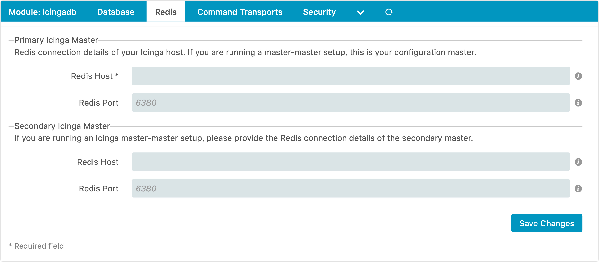
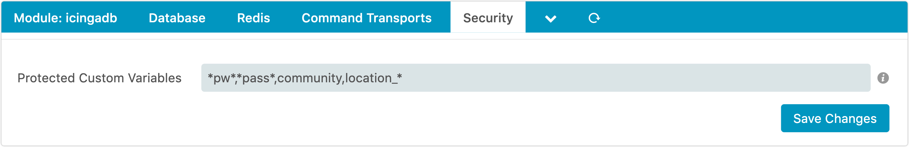

# Configuration

The Icinga DB web module comes with smart defaults, so it works right off the bat.
For more personalised configuration, you can find an overview over what you can change here.

## Database

Select the [database resource](https://icinga.com/docs/icingaweb2/latest/doc/04-Resources/#database) for your setup.

To set up a new one you need to navigate to 

`Configuration > Application > Ressources > Create a New Ressource` and follow the instructions from the [documentation](https://icinga.com/docs/icingaweb2/latest/doc/04-Resources/).

## Redis

Configure the Redis connection details of your Icinga host.  

If you are running a high availability zone with two masters, the first 2 fields are for your configuration master.

Option             | Description
-------------------|------------------------
Redis Host         | IP address or FQDN, usually this is your Icinga Master host
Redis Port         | The port which the Redis server is listening on

## Command Transports

Set [command transports](https://icinga.com/docs/icingaweb2/latest/modules/monitoring/doc/05-Command-Transports/) for specific Icinga instances.  
For more information check out the [documentation](https://icinga.com/docs/icingaweb2/latest/modules/monitoring/doc/05-Command-Transports/).

## Security

Protect your [custom variables](https://icinga.com/docs/icinga2/latest/doc/03-monitoring-basics/#custom-variables) with a comma separated, case insensitive list that supports wildcards.  
Existence of those custom variables will be shown, but their values will be masked.

