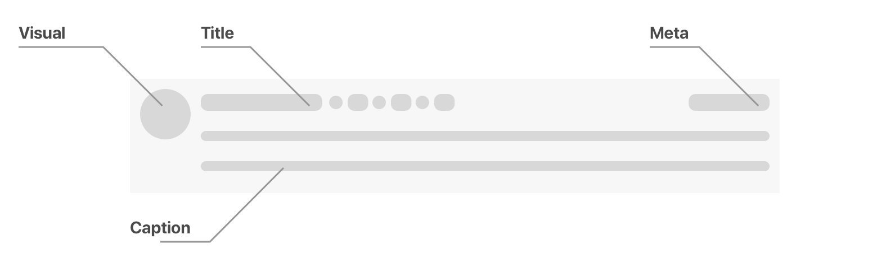
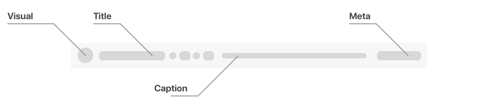
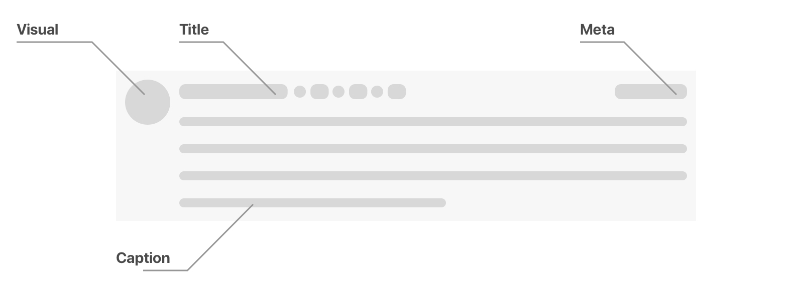
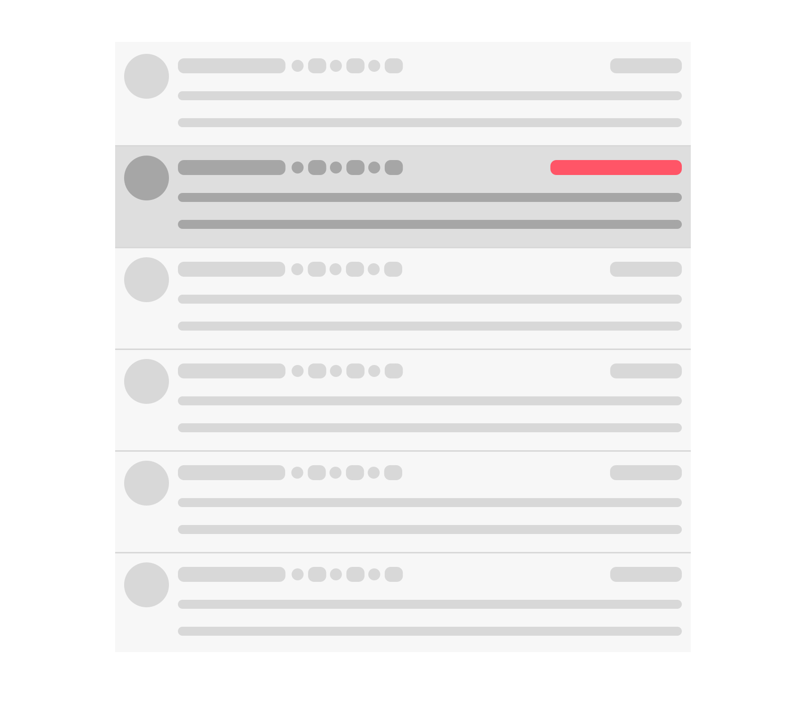
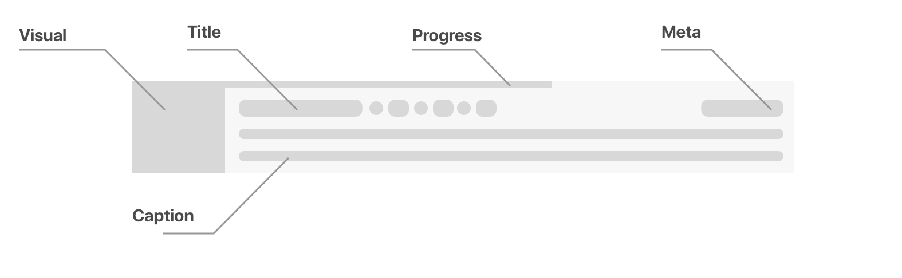
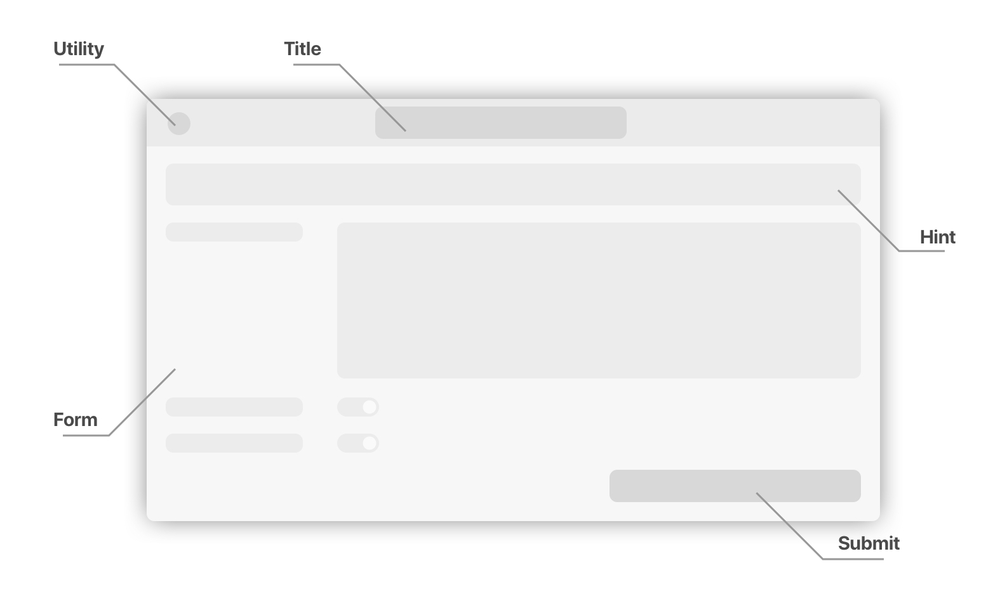
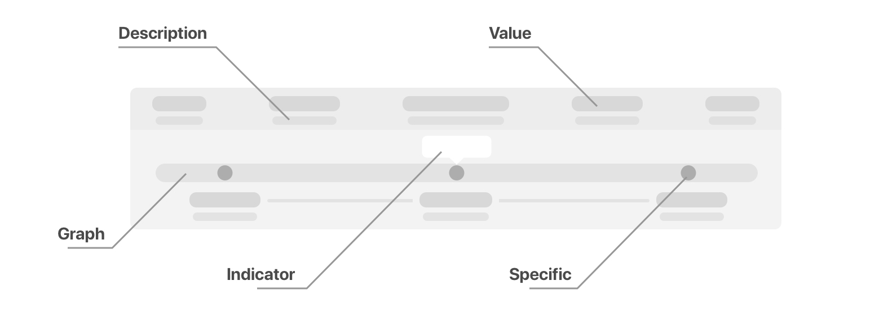

# Views

## List Items
Each list that is shown in the web interface consists of list items that follow this basic schema:

### Visual
Each element has a so-called visual. It's purpose is to highlight certain elements in long lists and give an intuitive overview about the underlying objects' condition. 
In the case of host or service lists, the state is displayed. This makes it obvious if and where there are problems that need to be taken care of, immediately from the overview.

### Title
The title briefly describes the state of the list element as an addition to the visual. For example, it contains the information that a host is currently DOWN state. While the visual gives an intuitive impression, the title explains what exactly happened.

### Meta
The meta area provides additional details, usually displays of time. In the host and service lists, you can see how long the object has been in its current state.

### Caption
The caption area contains detailed information about the list item. In the case of hosts and services this would be the check output. For comments and downtimes the comment texts of the user are displayed here. To make the default list view compact and consistent, long texts are truncated to a maximum of two lines.

## Different detail degrees

The level of detail of the host and service lists is selectable - the above image shows the default list item, but there are two more iterations:

In the compact mode the entire list item is displayed in one single line.
Given, that there is enough space, the caption is placed in the same line as the rest and trimmed to fit.

The detailed mode displays the entire caption, which makes it possible to react to problems directly from the list view.

## Overdue Items

In host and service lists overdue checks are highlighted. This makes it immediately apparent which objects may no longer be up-to-date. The red badge contains information about how long the check has been overdue.

## Downtimes
Downtime lists have an extra information to be displayed: the progress.
How far along the downtime is, is immeadiately visible via the progress bar at the top of each list item.
In the visual it is displayed how much time is left until the downtime ends.

# Modal
The modal element introduces short interaction dialogues. For actions in the detail area, a modal dialog will appear. This preserves the left list column and thus the content better.

### Utility
The utility or close button is one of three ways to close the modal without confirming your changes. It's also possible to just click outside it's borders or press the escape key to return to the previous page.

### Title
The title specifies the target, e.g. an action like: Acknowledge Problem, Add Comment or Schedule Downtime.

### Hint
The hint explains more about how to interact with the modal and what is asked of you. It goes into detail about the consequences from an action to your environment

### Form
The form is the main focus of the modal. It takes the call to action out of the normal page flow and makes it easy to focus on the task at hand.

### Submit
With the submit button you apply the selections you made in the form and return to where you left off.

# Details

## Check statistics
Information about check execution is available in a handy graph that makes it possible to get all of the information at a glance.

### Descriptions and Values
Instead of having a table with the different check information there is a header that lays out the information in an intuitive way, giving weight to more important bits of data and their values.

### Graph
The graphical element makes it easier to see, whether the check is on time or late. It's easy to immediately see the configured check interval and have a better grasp on how up-to-date the current state is.

### Indicator
The indicator visualises where the current time fits in for orientation.

### Specifics
The specifics put the exact times of the execution points in relation to each other. There are both the full timestamps and the passed time immediately visible.
