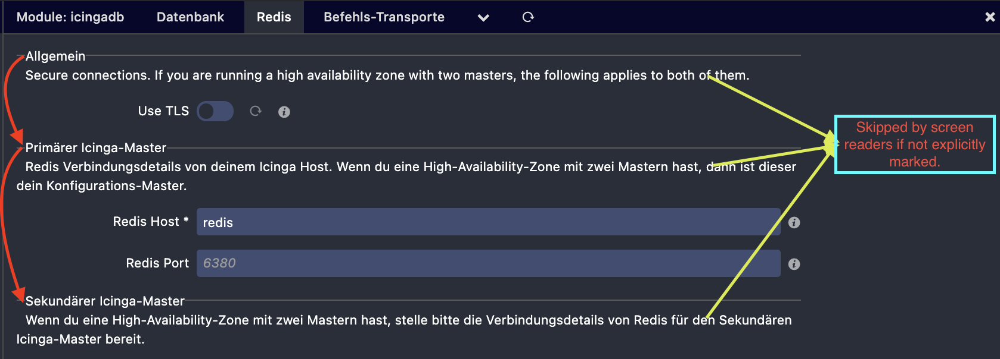
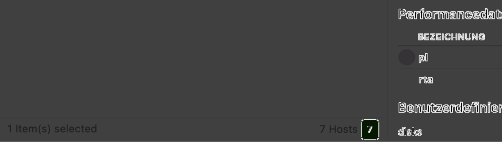
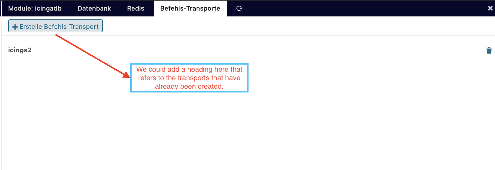
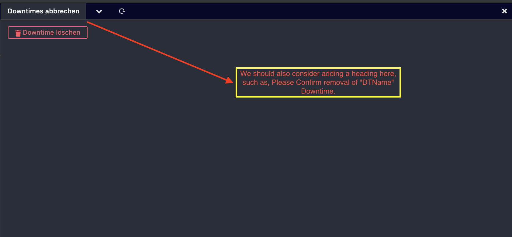

# Icinga DB lack of implementation of accessibility

## Environment used for testing
    Operatingsystem:    macOS Big Sur
    RAM:                16GB
    Browser:            Chrome
    Screenreader:       ChromeVox

## Perceivable

  - [ ] `role="Navigation"` is unnecessary for html `nav` tag, however, it's not Icinga DB specific rather in Icinga Web 2
  - [ ] [This](https://github.com/Icinga/icingaweb2/blob/master/application/layouts/scripts/layout.phtml#L89) is invalid I think.
  - [ ] [Tab index](https://github.com/Icinga/icingaweb2/blob/master/application/layouts/scripts/layout.phtml#L93) doesn't have a valid value.
  - [ ] [This](https://github.com/Icinga/icingaweb2/blob/master/application/layouts/scripts/body.phtml#L28), [this](https://github.com/Icinga/icingaweb2/blob/master/application/layouts/scripts/body.phtml#L35),
        [this](https://github.com/Icinga/icingaweb2/blob/master/application/layouts/scripts/body.phtml#L54), [this](https://github.com/Icinga/icingaweb2/blob/master/application/layouts/scripts/body.phtml#L69)
        und [this](https://github.com/Icinga/icingaweb2/blob/master/application/layouts/scripts/body.phtml#L97) aren't semantically correct markup.
        As the divs are being simulated as `header`, `footer` and `main` sections instead of applying the html `tags` provided for this purpose.
  - [ ] [This](https://github.com/Icinga/icingadb-web/blob/master/library/Icingadb/Widget/TagList.php#L17) isn't semantically correct markup.
        Because list items clearly shouldn't have divs as parent element.
  - [ ] [Element div](https://github.com/Icinga/icingadb-web/blob/master/library/Icingadb/Widget/Detail/CheckStatistics.php#L156-L159) as child of element `span` is invalid.
  - [ ] [VerticalKeyValue](https://github.com/Icinga/ipl-web/blob/master/src/Widget/VerticalKeyValue.php) &
        [AttemptBall](https://github.com/Icinga/icingadb-web/blob/master/library/Icingadb/Widget/AttemptBall.php) &
        [Card](https://github.com/Icinga/ipl-web/blob/master/src/Common/Card.php) widgets should use a more semantic html.
        These widgets should generally have another html tag instead of `divs` and using `br` tags is also simply wrong 😑.
  - [ ] [EmptyState](https://github.com/Icinga/icingadb-web/blob/master/library/Icingadb/Widget/EmptyState.php) should use semantic markup.
        Only for text output shouldn't be used `divs`. There are plenty of suitable html tags for this purpose.
  - [ ] [HorizontalKeyValue](https://github.com/Icinga/ipl-web/blob/master/src/Widget/HorizontalKeyValue.php#L27) have to use a html `label` tag.
  - [ ] [This tag](https://github.com/Icinga/ipl-web/blob/master/src/Control/PaginationControl.php#L41) can be replaced
        by a `nav` tag and the [role](https://github.com/Icinga/ipl-web/blob/master/src/Control/PaginationControl.php#L45) property would be superfluous and hence it would be removed.
  - [ ] Each of the `StateBadges` needs an `aria-label` properties like `n Unhandled CRITICAL Services/Hosts`,
      where `n` denotes the number of objects that are in the same `state`.
  - [ ] I propose that in `config/module/icingadb` the content of the `redis` tab should be redesigned, as the html
        structuring is not quite optimal for Screenreaders. I.e. it only reads the content of the fieldset `legend` tag
        but not the explanation of which e.g. a `span` tag contains.
  
  - [ ] This [html element](https://github.com/Icinga/icingaweb2/blob/master/library/Icinga/Web/Widget/Tabs.php#L313-L316)
        is not visible in Icinga Web 2. I just noticed it when the Screenreader read out the titles. When you actually can't see the
        cancel icon at all but on the other hand can be detected by the Screenreaders, it just causes confusion.
  - [ ] Number of elements aka (hashtag #️⃣) should have an `aria-label` added with meaningful description so that Screenreaders don't read it as a double cross.

  - **Feature Commands:**
    - [ ] Each checkbox requires either an `aria-label` or a hidden html `span` tag that tells the Screenreader what it does,
          IMO only the labels are insufficient.

  - [ ] [Contrast (Minimum)](https://www.w3.org/WAI/WCAG21/quickref/?versions=2.0#contrast-minimum): Generally it looks very nice,
    however there are some gaps in the lists, especially texts added after a click with JavaScript have no contrast at all.
  

## Operable
 
  - [x] **Keyboard - AAA:** All content functionality is operable via a keyboard interface, with no specific timing required
   for individual keystrokes. ✅
  - [ ] It lacks everywhere the `title` attribute, which describes the [purpose](https://www.w3.org/WAI/WCAG21/quickref/?versions=2.0#link-purpose-in-context)
        of each link.
  - [ ] [Section Headings](https://www.w3.org/WAI/WCAG21/quickref/?versions=2.0#section-headings): 
  
  - [ ] 

## Understandable

  - [ ] In the Overview, unfortunately, Screenreaders are reading everything twice as the donuts do have a html `label` tag and an `aria-label` property.
       Preferably, the html `label` tag shouldn't be detected by Screenreaders.
  - [ ] User Ball icon shouldn't also be detected by Screenreaders.
  - [ ] Every single of the `Searchbar` operators could tolerate an `aria-label` property to make it sound more understandable when Screenreaders read it aloud.
  - [ ] The labels of the list footers shouldn't be detected by Screenreaders either, once we have added a reasonable `aria-label` to the `StateBadges`.
  - [ ] The Screenreader is reading e.g. `10m 10s` as `10 meters` & `10 "S"`, `10h` as `10 "h"` and `/etc` as slash et cetera.
  Not sure what to do about it, though. I think it is somehow related to this [abbreviations](https://www.w3.org/WAI/WCAG21/quickref/?versions=2.0#abbreviations) guide.
